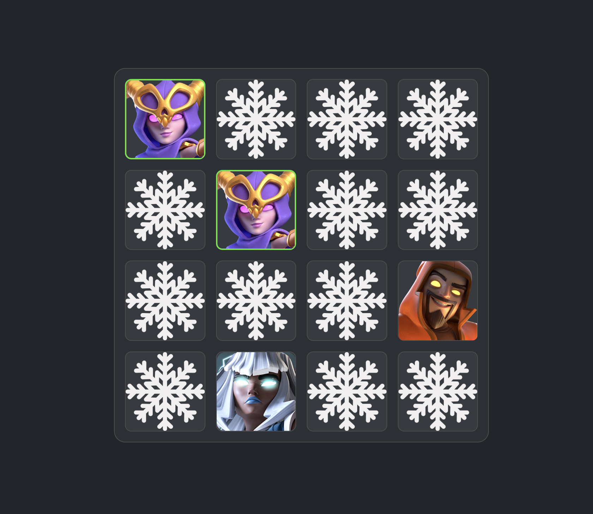

# 🃏 Clash Flipper - Memory Card Game

A fun and engaging memory card game featuring your favorite Clash of Clans characters! Test your memory skills by matching pairs of cards featuring iconic characters from the popular mobile game.



## 🎮 How to Play

- **Objective**: Find all matching pairs of Clash of Clans character cards
- **Gameplay**: Click on cards to flip them and reveal the characters
- **Matching**: Find two cards with the same character to create a match
- **Strategy**: Remember the positions of characters you've seen to make matches faster
- **Win Condition**: Match all character pairs to complete the game!

## ✨ Features

- **Clash of Clans Characters**: Features beloved characters like:

  - 🧙‍♀️ Head Witch
  - ⚡ Electro Titan
  - 🏹 Elite Archer
  - 🗡️ Elite Barbarian
  - 🧊 Ice Hound
  - 🎳 Super Bowler
  - ⛏️ Super Miner
  - 🔮 Super Wizard

- **Smooth Animations**: Beautiful card flip animations powered by Framer Motion
- **Responsive Design**: Works perfectly on desktop and mobile devices
- **Modern UI**: Clean and intuitive interface built with React and Material-UI

## 🚀 Getting Started

### Prerequisites

Make sure you have the following installed on your system:

- [Node.js](https://nodejs.org/) (version 14 or higher)
- [npm](https://www.npmjs.com/) (comes with Node.js)

### Installation

1. **Clone the repository**

   ```bash
   git clone https://github.com/yourusername/Clash-Flipper.git
   cd Clash-Flipper
   ```

2. **Install dependencies**

   ```bash
   npm install
   ```

3. **Start the development server**

   ```bash
   npm start
   ```

4. **Open your browser**
   The game will automatically open in your default browser at `http://localhost:3000`

### Building for Production

To create a production build:

```bash
npm run build
```

## 🛠️ Built With

- **React** - Frontend framework
- **Framer Motion** - Animation library
- **Material-UI** - UI component library
- **Styled Components** - CSS-in-JS styling
- **Create React App** - Development environment

## 📱 Game Controls

- **Mouse Click/Tap**: Flip cards
- **Automatic**: Cards automatically flip back if no match is found
- **Visual Feedback**: Matched cards stay revealed

## 🎯 Tips for Success

1. **Start with corners**: Begin by flipping cards in the corners to establish a pattern
2. **Remember positions**: Keep track of character locations as you discover them
3. **Take your time**: There's no time limit, so think strategically
4. **Look for patterns**: Some characters might be positioned in similar locations

## 🤝 Contributing

Feel free to contribute to this project! Whether it's:

- Adding new Clash of Clans characters
- Improving the UI/UX
- Adding new game modes
- Fixing bugs

## 📄 License

This project is open source and available under the [MIT License](LICENSE).

## 🙏 Acknowledgments

- Clash of Clans characters and assets belong to Supercell
- Built with love for the Clash of Clans community

---

**Have fun playing Clash Flipper! 🎮✨**
